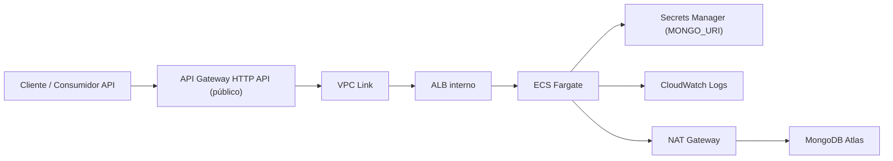

# API de Franquicias 🏪

API reactiva construida con **Spring Boot 3 + WebFlux** bajo **Clean Architecture** para administrar franquicias, sucursales y productos.

Repositorio: [anfega154/Franquicias](https://github.com/anfega154/Franquicias)

---

## Tabla de contenido

- [Arquitectura](#arquitectura)
- [Ejecución local](#ejecución-local)
- [Infraestructura AWS](#infraestructura-aws)
- [Despliegue con Terraform, ECR, ECS y API Gateway](#despliegue-con-terraform-ecr-ecs-y-api-gateway)
- [Pruebas con curl](#pruebas-con-curl)
- [Manejo de errores y resiliencia](#manejo-de-errores-y-resiliencia)
- [Documentación de estudio](#documentación-de-estudio)

---

## Arquitectura

### Arquitectura de código

- **Domain**: entidades, reglas de negocio, errores de dominio y puertos
- **Usecase**: orquesta los casos de uso
- **Infrastructure / driven adapters**: MongoDB Atlas y resiliencia
- **Infrastructure / entry points**: endpoints WebFlux, validaciones, traceId y manejo global de errores
- **Application**: configuración Spring Boot y wiring

### Arquitectura de despliegue



### Decisión de arquitectura

La API ya no debe exponerse directamente por el ALB público.  
La estrategia propuesta y codificada en Terraform es:

- **API Gateway** como punto de entrada público
- **VPC Link** para entrar de forma privada a la VPC
- **ALB interno** como balanceador privado
- **ECS Fargate** ejecutando la aplicación

Esto mejora:

- control del punto de entrada
- posibilidad futura de agregar auth, throttling, WAF y custom domain
- aislamiento del ALB

### Impacto del primer apply de migración

La primera vez que apliques estos cambios Terraform va a:

- crear API Gateway y VPC Link
- recrear el ALB como **interno**
- mover el punto de entrada público desde ALB hacia API Gateway

Eso implica una **ventana corta de cambio**.  
Hazlo en una franja controlada y valida al final con:

```bash
terraform output -raw api_gateway_url
curl -i "$(terraform output -raw api_gateway_url)/actuator/health"
```

---

## Ejecución local

### Requisitos

- Java 21+
- Docker
- Gradle Wrapper (`./gradlew`)

### Variables necesarias

La app necesita:

- `MONGO_URI`
- opcionalmente `SERVER_PORT`

### Ejecutar con Gradle

```bash
cd /Users/andresganan/Desktop/Retos/Franquicias
export MONGO_URI='mongodb+srv://<usuario>:<password>@<cluster>/?appName=anfega'
./gradlew clean bootRun
```

### Ejecutar con Docker Compose

```bash
cd /Users/andresganan/Desktop/Retos/Franquicias/deployment
docker compose up --build
```

### URLs locales

- Swagger: [http://localhost:8080/swagger-ui.html](http://localhost:8080/swagger-ui.html)
- OpenAPI: [http://localhost:8080/v3/api-docs](http://localhost:8080/v3/api-docs)
- Health: [http://localhost:8080/actuator/health](http://localhost:8080/actuator/health)

---

## Infraestructura AWS

### Recursos bootstrap creados manualmente

- Bucket S3 `terraform-state-anfega` para el state remoto
- Versionado del bucket habilitado
- Tabla DynamoDB `terraform-locks` para locking del state
- Secreto `MONGO_URI` en Secrets Manager

### Recursos creados por Terraform

#### Red

- VPC
- 2 subredes públicas
- 2 subredes privadas
- Internet Gateway
- NAT Gateway
- Route tables públicas y privadas

#### Seguridad

- Security Group del **API Gateway VPC Link**
- Security Group del **ALB interno**
- Security Group del **servicio ECS**

#### Exposición

- **API Gateway HTTP API** público
- **VPC Link**
- **ALB interno**
- Target group
- Listener HTTP interno

#### Cómputo y runtime

- ECR para la imagen
- ECS Cluster
- ECS Task Definition
- ECS Service en Fargate

#### Observabilidad

- CloudWatch log group de ECS
- CloudWatch log group de API Gateway
- Bucket S3 para access logs del ALB

### Outputs importantes

Después de aplicar Terraform:

```bash
cd /Users/andresganan/Desktop/Retos/Franquicias/deployment/terraform/service

terraform output -raw api_gateway_url
terraform output -raw alb_dns_name
terraform output -raw ecs_cluster_name
terraform output -raw ecs_service_name
terraform output -raw nat_public_ip
```

Interpretación:

- `api_gateway_url`: endpoint público para consumir la API
- `alb_dns_name`: DNS interno del ALB, útil para troubleshooting dentro de la VPC
- `nat_public_ip`: IP que debes permitir en MongoDB Atlas

---

## Despliegue con Terraform, ECR, ECS y API Gateway

Ruta Terraform:

- `/Users/andresganan/Desktop/Retos/Franquicias/deployment/terraform/service`

### 1. Validar Terraform

```bash
cd /Users/andresganan/Desktop/Retos/Franquicias/deployment/terraform/service
terraform fmt
terraform init -backend=false
terraform validate
```

### 2. Inicializar backend remoto

```bash
terraform init \
  -backend-config="bucket=terraform-state-anfega" \
  -backend-config="key=franquicias/dev/service.tfstate" \
  -backend-config="region=us-east-1" \
  -backend-config="dynamodb_table=terraform-locks" \
  -backend-config="encrypt=true"
```

### 3. Crear primero el repositorio ECR

```bash
terraform plan \
  -var-file=terraform.tfvars \
  -target=aws_ecr_repository.app \
  -out=ecr.tfplan

terraform apply ecr.tfplan
```

### 4. Obtener URL del ECR

```bash
export ECR_URL="$(terraform output -raw ecr_repository_url)"
export AWS_REGION="us-east-1"
export REGISTRY="$(echo "$ECR_URL" | cut -d/ -f1)"
```

### 5. Construir imagen desde Mac M4 correctamente

Como trabajas desde una Mac M4, **no debes usar `docker build` normal para producción en ECS**.  
Debes construir la imagen como `linux/amd64`.

```bash
cd /Users/andresganan/Desktop/Retos/Franquicias

export IMAGE_TAG="$(git rev-parse --short HEAD)-amd64"

aws ecr get-login-password --region "$AWS_REGION" \
  | docker login --username AWS --password-stdin "$REGISTRY"

docker buildx create --name franquicias-builder --use 2>/dev/null || docker buildx use franquicias-builder
docker buildx inspect --bootstrap

docker buildx build \
  --platform linux/amd64 \
  --provenance=false \
  -f deployment/Dockerfile \
  -t "$ECR_URL:$IMAGE_TAG" \
  --push \
  .
```

### 6. Aplicar infraestructura completa

```bash
cd /Users/andresganan/Desktop/Retos/Franquicias/deployment/terraform/service

terraform plan \
  -var-file=terraform.tfvars \
  -var="image_tag=$IMAGE_TAG" \
  -out=service.tfplan

terraform apply service.tfplan
```

> La primera migración a API Gateway recrea el ALB. Después del apply, deja de usar el DNS público viejo del ALB y prueba únicamente con `api_gateway_url`.

### 7. Permitir salida hacia MongoDB Atlas

```bash
export NAT_IP="$(terraform output -raw nat_public_ip)"
echo "$NAT_IP"
```

Agregar en MongoDB Atlas:

```text
<NAT_IP>/32
```

### 8. Forzar redeploy si necesitas refrescar tareas

```bash
export CLUSTER_NAME="$(terraform output -raw ecs_cluster_name)"
export SERVICE_NAME="$(terraform output -raw ecs_service_name)"

aws ecs update-service \
  --region "$AWS_REGION" \
  --cluster "$CLUSTER_NAME" \
  --service "$SERVICE_NAME" \
  --force-new-deployment
```

### 9. Ver logs y estado

```bash
aws logs tail /ecs/franquicias-dev --region "$AWS_REGION" --follow

aws ecs describe-services \
  --region "$AWS_REGION" \
  --cluster "$CLUSTER_NAME" \
  --services "$SERVICE_NAME"
```

---

## Pruebas con curl

Después del apply:

```bash
cd /Users/andresganan/Desktop/Retos/Franquicias/deployment/terraform/service

export PUBLIC_API_URL="https://4jbqr8awo0.execute-api.us-east-1.amazonaws.com"
export TRACE_ID="e6da272e-6bae-4900-a144-e60ef5df8f58"
```

### Health

```bash
curl -i "$PUBLIC_API_URL/actuator/health"
```

### Swagger

```bash
curl -I "$PUBLIC_API_URL/swagger-ui.html"
```

### OpenAPI

```bash
curl "$PUBLIC_API_URL/v3/api-docs"
```

### Crear franquicia

```bash
curl -X POST "$PUBLIC_API_URL/api/v1/franquicias" \
  -H "Content-Type: application/json" \
  -H "X-B3-TraceId: $TRACE_ID" \
  -d '{
    "name": "Franquicia Demo"
  }'
```

### Crear sucursal

```bash
curl -X POST "$PUBLIC_API_URL/api/v1/sucursales" \
  -H "Content-Type: application/json" \
  -H "X-B3-TraceId: $TRACE_ID" \
  -d '{
    "name": "Sucursal Centro",
    "franchiseName": "Franquicia Demo"
  }'
```

### Crear producto

```bash
curl -X POST "$PUBLIC_API_URL/api/v1/productos" \
  -H "Content-Type: application/json" \
  -H "X-B3-TraceId: $TRACE_ID" \
  -d '{
    "name": "Producto A",
    "stock": 25,
    "branchName": "Sucursal Centro",
    "franchiseName": "Franquicia Demo"
  }'
```

### Actualizar stock

```bash
curl -X PUT "$PUBLIC_API_URL/api/v1/productos/update-stock?id=PRODUCT_ID" \
  -H "Content-Type: application/json" \
  -H "X-B3-TraceId: $TRACE_ID" \
  -d '{
    "stock": 99
  }'
```

### Eliminar producto

```bash
curl -X DELETE "$PUBLIC_API_URL/api/v1/productos?id=PRODUCT_ID" \
  -H "X-B3-TraceId: $TRACE_ID"
```

### Top productos por sucursal

```bash
curl -X GET "$PUBLIC_API_URL/api/v1/franchises/Franquicia%20Demo/top-products-per-branch" \
  -H "X-B3-TraceId: $TRACE_ID"
```

---

## Manejo de errores y resiliencia

### Manejo de errores

Archivos principales:

- `/Users/andresganan/Desktop/Retos/Franquicias/infrastructure/entry-points/reactive-web/src/main/java/co/com/anfega/api/helper/error/GlobalErrorHandler.java`
- `/Users/andresganan/Desktop/Retos/Franquicias/infrastructure/entry-points/reactive-web/src/main/java/co/com/anfega/api/config/TraceIdFilter.java`
- `/Users/andresganan/Desktop/Retos/Franquicias/domain/model/src/main/java/co/com/anfega/model/common/error/ErrorCode.java`

Qué se mejoró:

- mensajes de error más cortos y claros
- respuestas de validación con mensajes deduplicados
- `traceId` generado por el servidor cuando el cliente envía un header inválido
- respuestas consistentes para errores de JSON, validación, not found y persistencia

### Resiliencia

Archivo principal:

- `/Users/andresganan/Desktop/Retos/Franquicias/infrastructure/driven-adapters/mongo-repository/src/main/java/co/com/anfega/mongo/helper/MongoResilienceExecutor.java`

Qué hace:

- timeout de `3000 ms`
- circuit breaker con Resilience4j
- mapea fallos técnicos de Mongo a respuestas de negocio controladas

Esto evita cascadas de fallo cuando MongoDB Atlas está lento o indisponible.

---

## Documentación de estudio

Guía detallada:

- `/Users/andresganan/Desktop/Retos/Franquicias/docs/deployment-study-guide.md`

Incluye:

- qué hace cada comando ejecutado
- qué recursos crea AWS y para qué sirven
- cómo redeployar cambios
- problemas reales encontrados y cómo resolverlos
- explicación de resiliencia y cómo sustentarla en entrevista
